# 🎓 Student Management System

A command-line **Student Management System** developed in **Python** as part of my Programming Fundamentals learning journey.

The application enables users to perform CRUD (Create, Read, Update, Delete) operations on student records through a simple menu-driven interface while storing data persistently using CSV files. This project was built to strengthen my understanding of Python fundamentals, file handling, and structured programming.

---

# ⭐ Features

* ➕ Add Student Records
* 📋 View All Students
* 🔍 Search Students by Roll Number
* ✏️ Update Student Information
* ❌ Delete Student Records
* 💾 Store Data Permanently Using CSV File Handling

---

# 🛠️ Technologies Used

* Python
* CSV Module
* File Handling

---

# 📚 Programming Concepts Practiced

This project helped strengthen my understanding of:

* Functions
* Loops
* Conditional Statements
* Lists
* Dictionaries
* User Input Handling
* File Handling
* CSV Data Management

---

# ⚙️ Application Workflow

The system stores student records using:

* A **list** to manage multiple student records.
* A **dictionary** to represent each individual student's information.

Each student record contains:

* Name
* Roll Number
* Marks
* Grade

The application uses Python's built-in **CSV module** for persistent data storage.

### Workflow

1. Existing student data is loaded from the CSV file when the program starts.
2. Users can add, search, update, or delete student records.
3. Any changes are automatically saved back to the CSV file.
4. The updated records are available the next time the application is launched.

---

# 📁 Project Structure

```text
student-management-system/
│
├── main.py
├── students.csv
├── README.md
└── screenshots/
```

---

# 📸 Application Screenshots

## Main Menu

The main menu allows users to access all available features, including adding, viewing, searching, updating, and deleting student records.

---

## ➕ Add Student

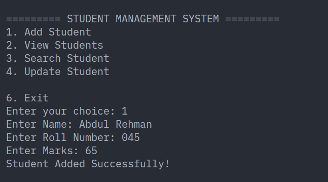

---

## 📋 View Students

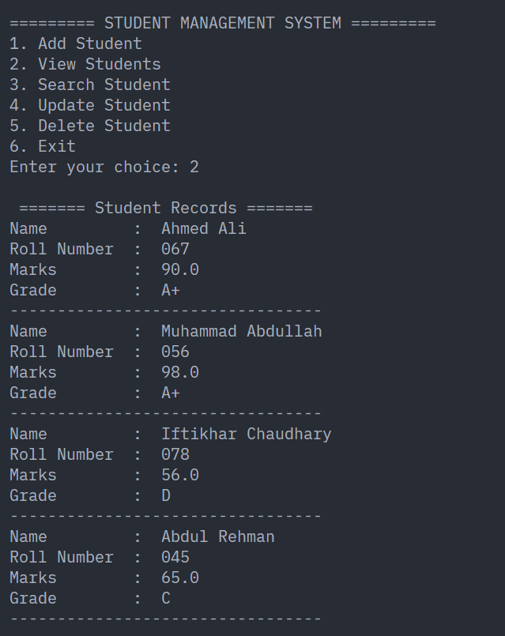

---

## 🔍 Search Student

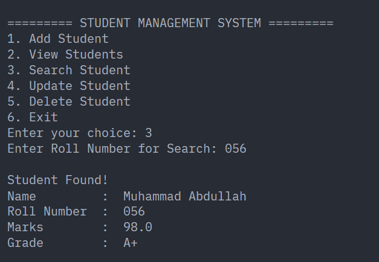

---

## ✏️ Update Student

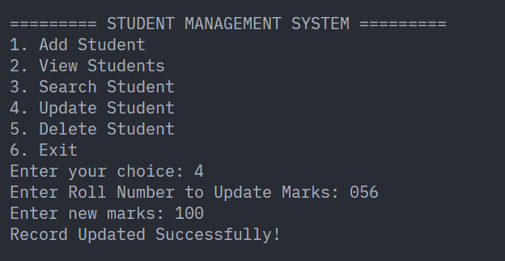

---

## ❌ Delete Student

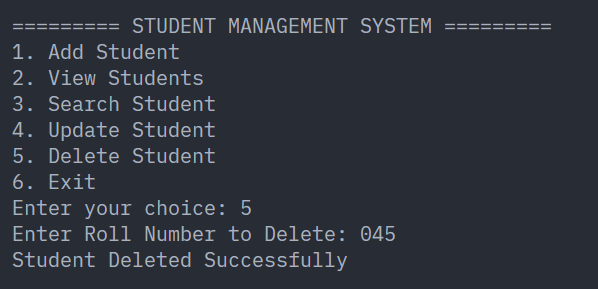

---

## 📂 Updated Records

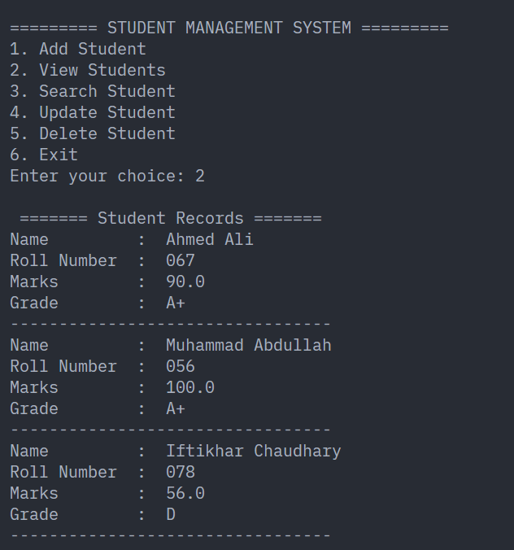

---

## 🚪 Exit Program

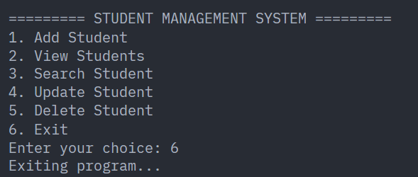

---

# 💻 Code Walkthrough

## Grade Calculation Function

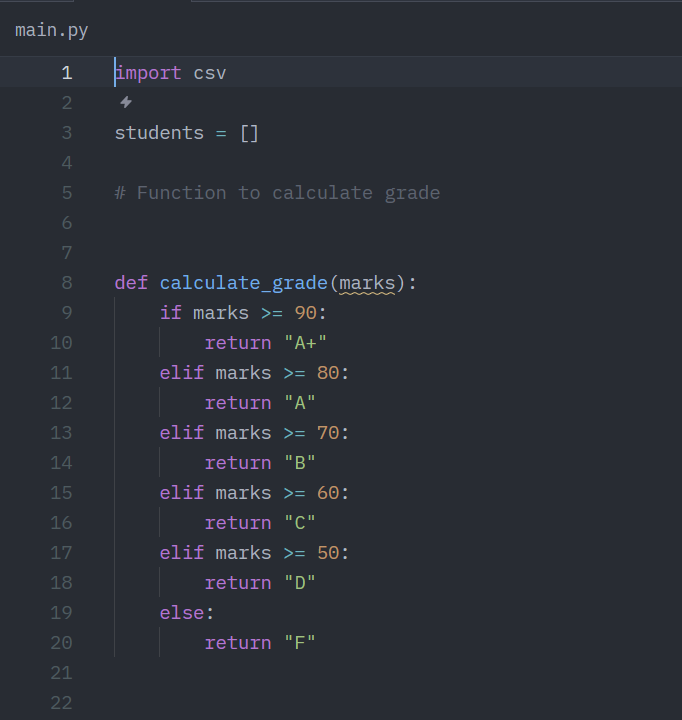

Calculates the student's grade based on the marks entered.

---

## Saving Data to CSV

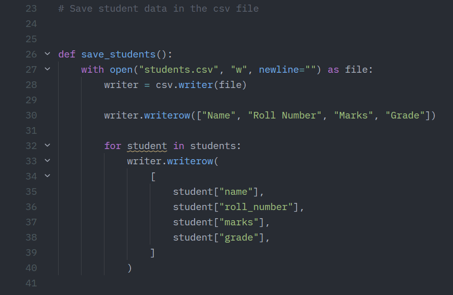

Writes student records to the CSV file, ensuring data persists between program executions.

---

## Loading Data from CSV

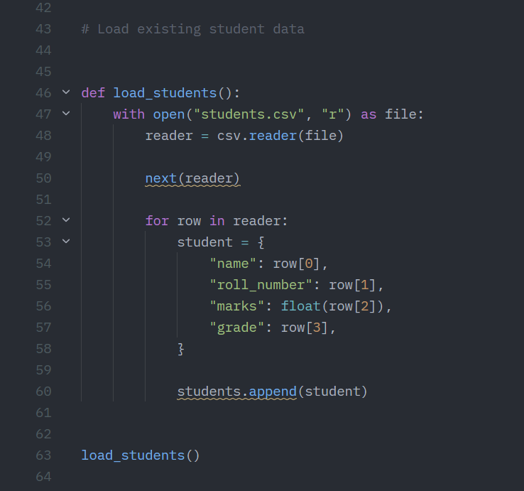

Loads existing student records into memory when the application starts.

---

## Main Menu & Add Student Logic

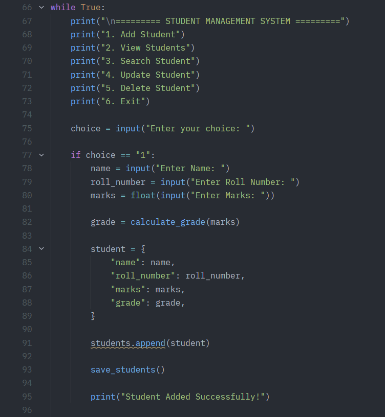

Implements the menu-driven interface and handles the addition of new student records.

---

## View & Search Student Logic

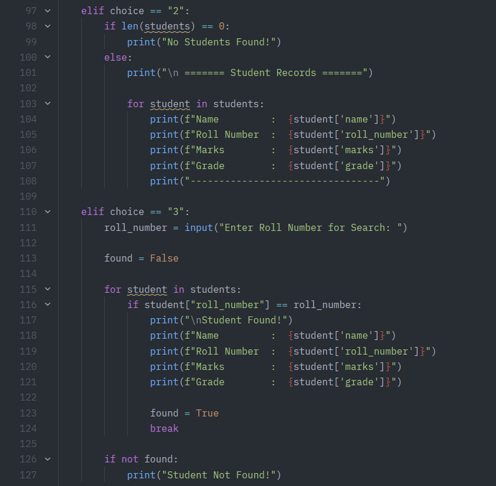

Displays all student records and searches for a student using their roll number.

---

## Update Student Logic

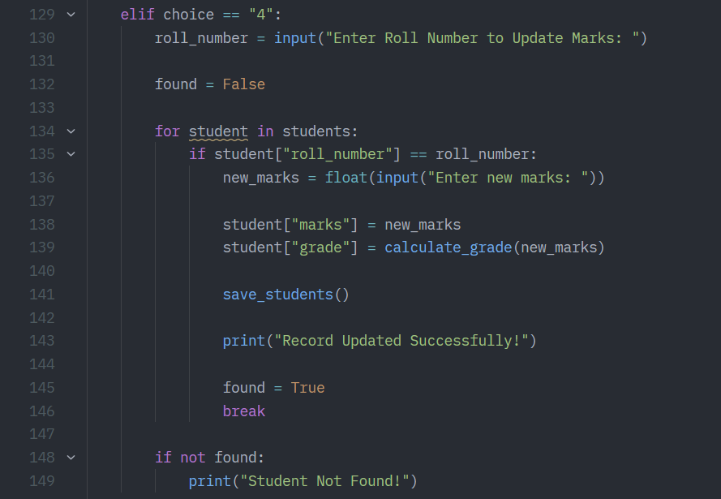

Allows users to modify the information of an existing student.

---

## Delete Student Logic

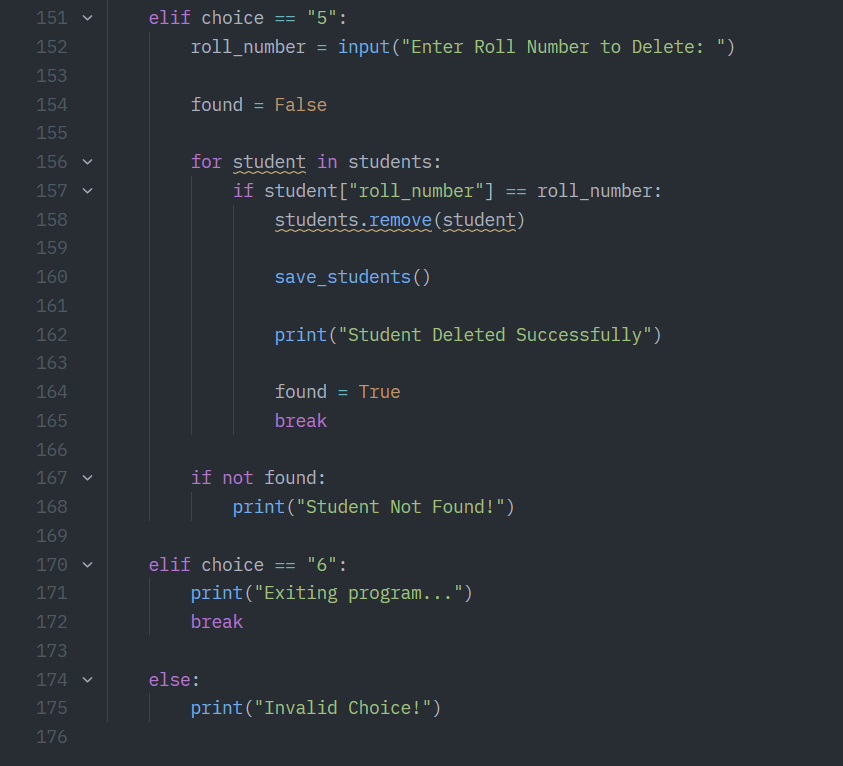

Removes a selected student record and updates the CSV file.

---

# 🚀 Future Improvements

Potential enhancements include:

* GUI-based interface
* Database integration
* Login and authentication system
* Advanced search and filtering
* Improved input validation

---

# 📚 Learning Outcomes

Through this project, I gained practical experience in:

* Writing modular Python programs
* Managing structured data
* Working with CSV files
* Implementing CRUD operations
* Improving code organization and readability

---

# 👨‍💻 Author

**Muhammad Abdullah**

BSCS Student at COMSATS University Islamabad

GitHub: https://github.com/abdullahcodes-dev

---

# ⭐ Feedback

Feedback, suggestions, and improvements are always welcome.
